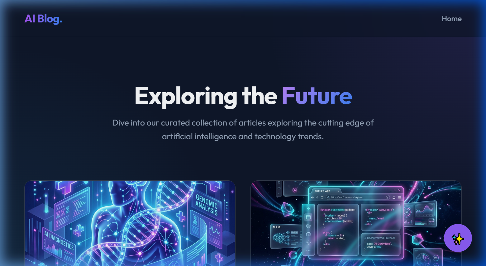
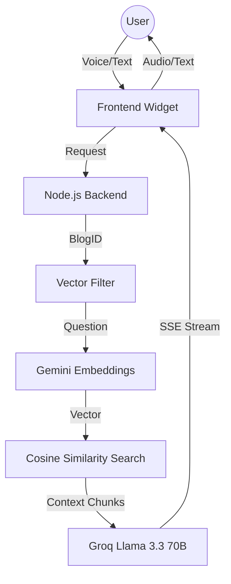

# 🚀 AI Blog Expert: Hybrid RAG Voice & Chat Assistant

A state-of-the-art AI-powered blog platform featuring a premium glassmorphic interface and a high-performance **Hybrid RAG (Retrieval-Augmented Generation)** assistant. This project combines the deep semantic understanding of Google Gemini with the ultra-low latency generation of Groq.



## 🌟 Key Features

- **💎 Premium Design**: Sleek, glassmorphic UI built with React and Vanilla CSS, featuring smooth animations, dark mode, and a responsive layout.
- **🎤 Ultra-Fast Voice Agent**: Integrated with **Vapi**, providing a near-zero latency voice experience powered by Groq's custom hardware.
- **💬 Intelligent Chat Widget**: Context-aware text assistant capable of deep article analysis and factual answers.
- **🧠 Hybrid RAG Architecture**:
  - **Embeddings**: Uses Google's `text-embedding-004` via the **Gemini SDK** for state-of-the-art semantic search.
  - **Inference (LLM)**: Uses **Groq (Llama 3.3 70B)** for lightning-fast, conversational responses (under 1 second).
  - **Grounding**: Strict context-locking ensures the AI only discusses the active article, preventing hallucinations.
- **⚡ Automated Bridge**: Backend automatically manages **Cloudflare Tunnels** and reconfigures the Vapi Assistant URL on every startup.

## 🏗️ Architecture Flow



## 🛠️ Technology Stack

- **Frontend**: React 19, Vite, React Router, Vapi Web SDK.
- **Backend**: Node.js, Express, @google/genai, Groq SDK.
- **AI Infrastructure**: Gemini (Embeddings), Groq (Inference), Vapi (Voice AI).
- **Tooling**: Cloudflared (Tunneling), Dotenv, Cheerio.

## 🚀 Getting Started

### 1. Prerequisites
- [Node.js](https://nodejs.org/) (v20+)
- [Gemini API Key](https://aistudio.google.com/)
- [Groq API Key](https://console.groq.com/)
- [Vapi Account](https://vapi.ai/)

### 2. Environment Setup
Create a `.env` file in the `backend/` directory:
```env
GEMINI_API_KEY=your_gemini_key
GROQ_API_KEY=your_groq_key
VAPI_PRIVATE_KEY=your_vapi_private_key
VAPI_ASSISTANT_ID=your_assistant_id
```

### 3. Installation & Run

1. **Install Dependencies:**
   ```bash
   # Root
   npm install
   # Backend
   cd backend && npm install
   # Frontend
   cd ../frontend && npm install
   ```

2. **Ingest Blog Data:**
   ```bash
   cd backend
   npm run ingest
   ```

3. **Start the Platform:**
   ```bash
   # Terminal 1 (Backend)
   cd backend
   npm run dev

   # Terminal 2 (Frontend)
   cd frontend
   npm run dev
   ```

## 📖 Deep Dive: How the Voice Agent Works

Unlike standard LLM integrations, this project implements a custom **OpenAI-Compatible Streaming Bridge**:

1. **Handshake:** When the voice call starts, the frontend sends the `blogId` to the backend.
2. **Context Retrieval:** The backend performs a semantic search scoped **only** to that blog article.
3. **SSE Protocol:** The backend streams tokens back to Vapi using the OpenAI SSE format, including mandatory role announcement chunks to prevent connection drops.
4. **Proxy Flushing:** Uses `X-Accel-Buffering` and manual header flushing to ensure tokens reach the user instantly through the Cloudflare Tunnel.

---
*Created with ❤️ by Ashhadk7 - Advancing Agentic Coding*
